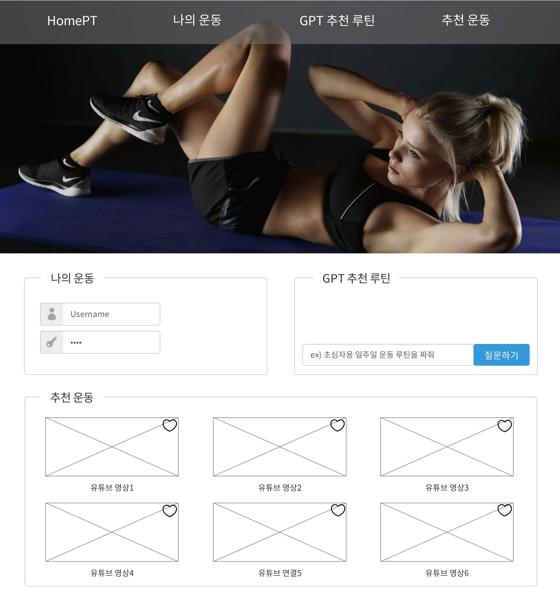
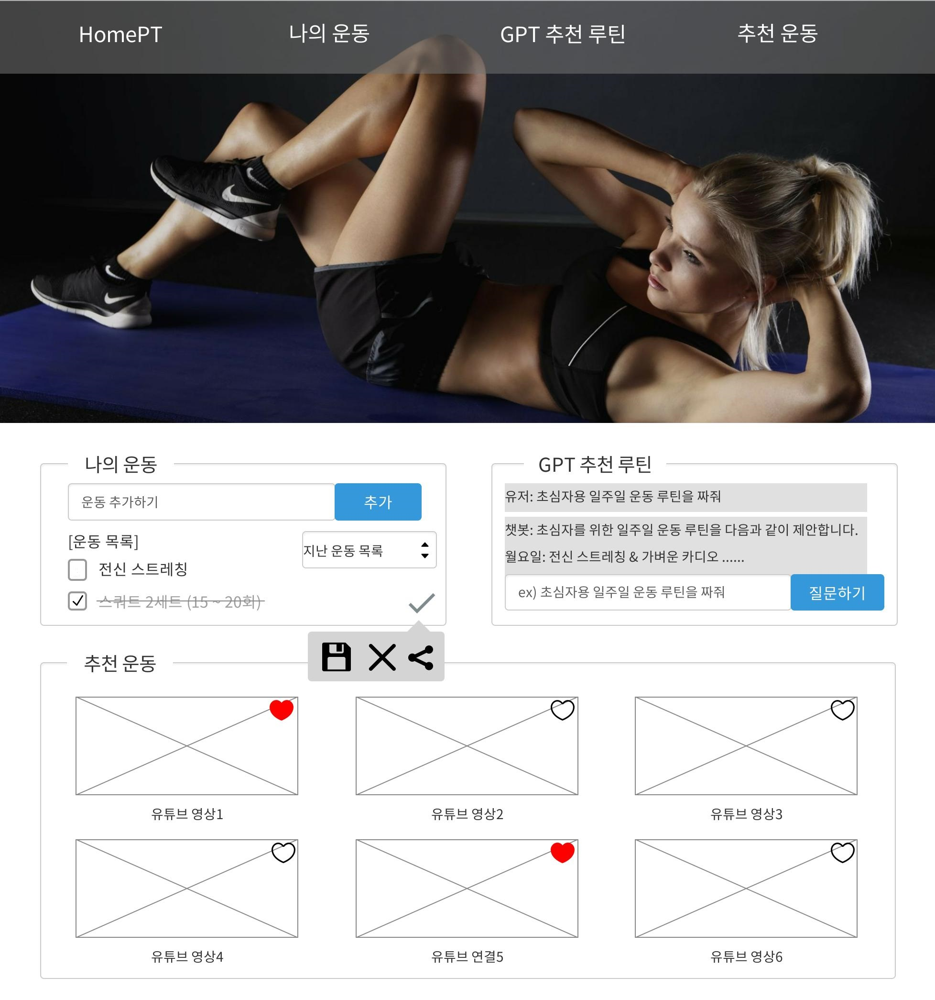

# HomePT

운동하러 갈 시간이 없는 바쁜 현대인을 위한 홈트 추천 웹서비스

* 목표
    * 개인의 수준에 맞는 난이도와 집중적으로 운동하고 싶은 부위 별 추천
    * GPT가 추천해준 운동을 '나의 운동'이라는 리스트에 저장하고 리스트에 따로 본인이 원하는 운동을 추가, 삭제 가능
    * 자신의 운동 루틴을 다른 사용자에게 공유, 배포
    * 그 밖에 추천 영상이나 다른 사용자의 추천 루트를 마크하여 마크해둔 것만 볼 수 있게 하는 기능

* 사용방법
    1. gpt를 통해 원하는 운동루틴을 추천받는다.
    2. 추천 받은 루틴을 나의 운동에 저장하고, 그 밖에 내가 원하는 운동을 따로 추가, 삭제한다.
    3. 완료한 운동의 체크박스를 누르면 완료가 되고, 오른쪽 하단에 체크 버튼을 누르면 해당 회차를 저장, 새 회차를 생성한다.

* 서비스 URL 정보
    * 실행 URL: https://yooji3un.github.io/HomePT/
    * github repo: https://github.com/YooJi3un/HomePT

* 이점
    * 정보의 바다에서 원하는 운동 법을 찾기 쉽게 해준다.
    * 집중적으로 운동하고 싶은 부위 별로 찾게 해준다.
    * gpt를 통해 하루 이틀이 아닌 일주일 단위로 체계적인 운동 루틴을 만들 수 있게 해준다.
    * 뿐만 아니라 유저들끼리 운동 루틴 공유를 통해 더욱 퀄리티 좋은 운동 루틴을 만들 수 있게 해준다.

* 구조

* 폴더 트리

    | 폴더명 | 파일명 | 함수 | 변수 | 비고 |
    |--------|--------|------|------|------|
    | style  | main.css | | | 전반적인 디자인 설정 |
    |      | main.js | addExercise() | | 체크박스 이벤트, 삭제시 물어보는 알림 |
    |      | gpt.js | addMessage(), fetchAIResponse() | chatMessages, userInput, sendButton, inputdata | gpt를 연결, 원하는 값 받아오기 |

* WBS

* 화면 정의서
    <table>
        <tr>
            <th>로그인 전 화면</th>
            <th>설명</th>
        </tr>
        <tr>
            <td width="70%">
                
            </td>
            <td>
                <ul>
                    <li>상단 목록바를 클릭하여 원하는 곳으로 이동 가능</li>
                    <li>나의 운동 메뉴는 로그인 후 사용</li>
                    <li>gpt 사용은 로그인 없이도 사용 가능</li>
                    <li>추천 운동 목록을 6개씩 잘라내어 부드럽게 넘기기</li>
                    <li>마크와 조회수가 많은 추천 운동을 상단에 배치</li>
                </ul>
            </td>
        </tr>
    </table>
    <table>
        <tr>
            <th>로그인 후 화면</th>
            <th>설명</th>
        </tr>
        <tr width="70%">
            <td width="70%">
               
            </td>
            <td>
                <ul>
                    <li>gpt가 추천해준 루틴을 '나의 운동'에 저장 가능</li>
                    <li>운동 추기하기에 적고 추가 버튼을 누르면 [운동 목록] 리스트 생성</li>
                    <li>운동 목록에 추가 된 텍스트를 클릭하면 삭제하시겠습니까? 하는 알람창 생성</li>
                    <li>운동 목록에 체크박스를 누르면 취소선과 함께 회색으로 변경</li>
                    <li>추가 버튼 아래 항목으로 지난 운동을 볼 수 있음</li>
                    <li>나의 운동 우측 하단의 체크 버튼을 누르면 저장, 현 페이지 운동 전부 삭제, 공유 가능</li>
                </ul>
            </td>
        </tr>
    </table>

*<strong>실제 gpt 작동 화면</strong>

* 현재까지 구현 된 화면

  

  

  

* 과업
    * 로그인 기능
    * 추천 운동 목록 6개씩 잘라내어 부드럽게 넘기기
    * 마크와 조회수를 바탕으로 추천 운동 순서 배치
    * gpt가 추천해준 루틴을 '나의 운동'에 저장 가능하게 하는 기능
    * 지난 운동을 볼 수 있게 하는 기능
    * '나의 운동'을 저장, 현 페이지 운동 전부 삭제, 내 운동 공유하는 기능
    * 추천 목록에 마크하고 마크 한 것만 불러오는 기능
    * gpt 사용시 입력 완료 되면 입력칸 초기화 하는 기능

* 애러와 애러 해결(트러블슈팅 히스토리)

     
    * 어려웠던 것
        * css, js 코드 구현 및 연결
        * html에 과한 div 사용
        * 운동 추가 시 추가 버튼을 클릭 할 뿐만 아니라 엔터키를 사용했을 때 추가 할 수 있는 기능 (미구현)
        * gpt를 불러오는 기능 
